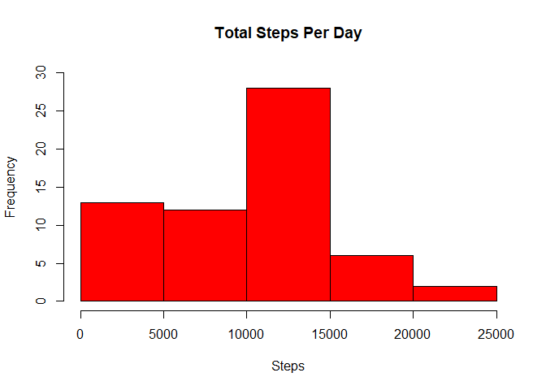
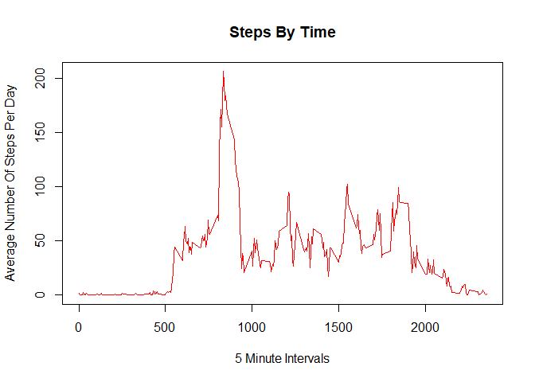
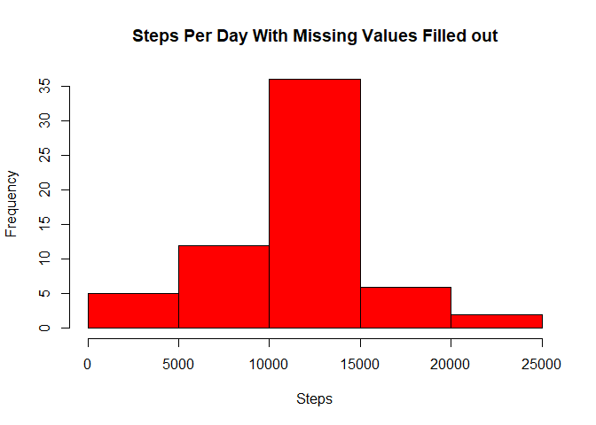

rrassignment
================
TheLittleScientist
27/1/2022

## First the desired libraries are chosen and the data is loaded.

``` r
library(dplyr)
```

    ## 
    ## Vedhæfter pakke: 'dplyr'

    ## De følgende objekter er maskerede fra 'package:stats':
    ## 
    ##     filter, lag

    ## De følgende objekter er maskerede fra 'package:base':
    ## 
    ##     intersect, setdiff, setequal, union

``` r
library(ggplot2)

activity <- read.csv("activity.csv")
activity$date <- as.Date(activity$date)
```

## The total sum of steps per day is calculated.

``` r
stepsPerDay <- activity %>%
  group_by(date) %>%
  summarize(sumsteps = sum(steps, na.rm = TRUE)) 
```

## A histogram showing the total numer of steps per day.

``` r
hist(stepsPerDay$sumsteps, main = "Total Steps Per Day", 
     col="red", xlab="Steps", ylim = c(0,30))
```

<!-- -->

## The mean of total steps per day is calculated.

``` r
meansteps <- (mean(stepsPerDay$sumsteps))
print(meansteps)
```

    ## [1] 9354.23

## The median of total steps per day is calculated.

``` r
mediansteps <- (median(stepsPerDay$sumsteps))
print(mediansteps)
```

    ## [1] 10395

## The average of steps per days are calculated.

``` r
stepsPerInterval <- activity %>%
  group_by(interval) %>%
  summarize(averagesteps = mean(steps, na.rm = TRUE)) 
```

## A time series plot is made average across all days.

``` r
plot(stepsPerInterval$averagesteps ~ stepsPerInterval$interval,
     col="red", type="l", xlab = "5 Minute Intervals", ylab = "Average Number Of Steps Per Day",
     main = "Steps By Time")
```

<!-- -->

## The interval for the maximumber nuber of steps on avarage is calculated.

``` r
print(stepsPerInterval$interval[which.max(stepsPerInterval$averagesteps)])
```

    ## [1] 835

## The number of missing values are calculated.

``` r
print(sum(is.na(activity$steps)))
```

    ## [1] 2304

## The missing values is filled out with the average steps.

``` r
activityNoNA <- activity  
for (i in 1:nrow(activity)){
  if(is.na(activity$steps[i])){
    activityNoNA$steps[i]<- stepsPerInterval$averagesteps[activityNoNA$interval[i] == stepsPerInterval$interval]
  }
}
```

## A new dataset is made with the added missing values.

``` r
stepsPerDayNew <- activityNoNA %>%
  group_by(date) %>%
  summarize(sumsteps = sum(steps, na.rm = TRUE)) 

hist(stepsPerDayNew$sumsteps, main = "Steps Per Day With Missing Values Filled out", 
     col="red", xlab="Steps")
```

<!-- -->

## A new mean is calculated.

``` r
meanNew <- (mean(stepsPerDayNew$sumsteps))
print(mean(meanNew))
```

    ## [1] 10766.19

## A new median is calculated.

``` r
medianNew <- (median(stepsPerDayNew$sumsteps))
print(median(medianNew))
```

    ## [1] 10766.19

## We see that there is a difference from befores as the mean and median are now a bit higher after the missing values have been filled out.

## A new factor that splits the dataset into weekdays or weekends are then made.

``` r
activityWoW <- activityNoNA
activityWoW$date <- as.Date(activityWoW$date)
activityWoW$day <- ifelse(weekdays(activityWoW$date) %in% c("lørdag", "søndag"), "weekend", "weekday")
activityWoW$day <- as.factor(activityWoW$day)
```

## A panel with the average number of steps is made with the average of weekdays and weekends.

``` r
activityWeekday <- filter(activityWoW, activityWoW$day == "weekday")
activityWeekend <- filter(activityWoW, activityWoW$day == "weekend")

activityWeekday <- activityWeekday %>%
  group_by(interval) %>%
  summarize(steps = mean(steps)) 
activityWeekday$day <- "weekday"

activityWeekend <- activityWeekend %>%
  group_by(interval) %>%
  summarize(steps = mean(steps)) 
activityWeekend$day <- "weekend"

weekdayorweekend <- rbind(activityWeekday, activityWeekend)
weekdayorweekend$day <- as.factor(weekdayorweekend$day)

g <- ggplot (weekdayorweekend, aes (interval, steps))
g + geom_line() + facet_grid (day~.) + 
        theme(axis.text = element_text(size = 12),axis.title = element_text(size = 14)) + 
        labs(y = "Number of Steps") + labs(x = "Interval") + 
        ggtitle("Average Number of Steps - Weekday vs. Weekend") + 
        theme(plot.title = element_text(hjust = 0.5)) 
```

<!-- -->
